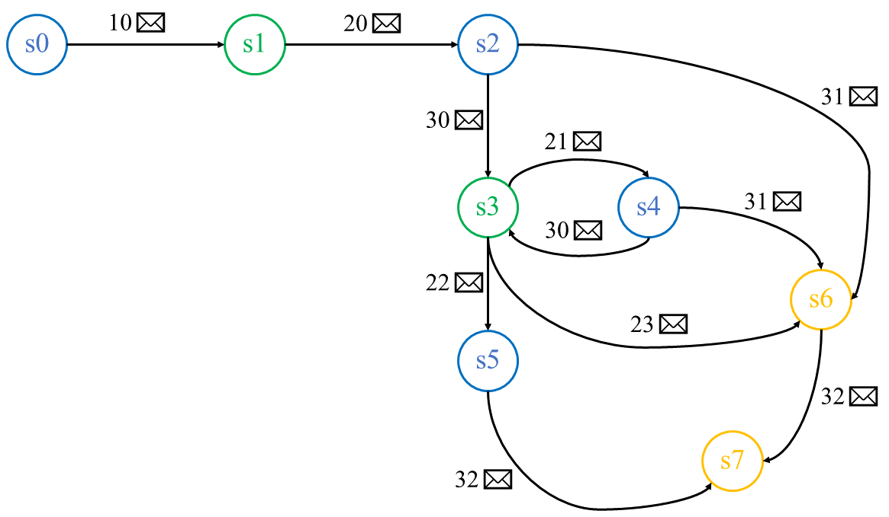

# 
# Redes de Computadoras


## Proyecto: Creación e implementación de un protocolo de la Capa de Aplicación

## Objetivo:
* El estudiante diseñará un protocolo de la capa de aplicación, con una utilidad específica.
* El estudiante implementará este protocolo tanto para el cliente como para el servidor.

## Desarrollo
Diseñar un protocolo de la capa de aplicación, el cliente solicitará un Pokémon a capturar, el servidor lo ofrecerá y aleatoriamente indicará si se capturó o no.


### 1. Diseño del protocolo
En la *FSM* de la siguiente figura se presenta el comportamiento básico de la aplicación, y en la tabla la descripción de los estados.

# 

Estado | Descripción                                                                                                        |
-------|--------------------------------------------------------------------------------------------------------------------|
s0     | Estado inicial, desde aquí comienza la conexión del protocolo de la capa de aplicación.                            |
s1     | Recibe solicitud del cliente, ofrece aleatoriamente un Pokémon para capturar.                                      |
s2     | Indica si quiere capturar o no el Pokémon ofrecido.                                                                |
s3     | Inicia un contador con *n* como el máximo número de intentos. Aleatoriamente indica si se capturó al Pokémon o no. |
s4     | Da respuesta para reintentar captura de Pokémon.                                                                   |
s5     | Se recibe Pokémon capturado, que sería una imagen.                                                                 |
s6     | Terminando la sesión.                                                                                              |
s7     | Cierre de conexión.                                                                                                |

A continuación se definen los tipos de mensajes a utilizar,

Código | Descripción                                                            |
-------|------------------------------------------------------------------------|
10     | Solicitar al servidor por parte del cliente, un Pokémon para capturar. |

Código | Descripción                                    |
-------|------------------------------------------------|
20     | ¿Capturar al Pokémon x?                        |
21     | ¿Intentar captura de nuevo? Quedan k intentos. |
22     | Envía Pokémon, la imagen, capturado.           |
23     | Intentos de captura agotados.                  |

Código | Descripción        |
-------|--------------------|
30     | Sí.                |
31     | No.                |                 
32     | Terminando sesión. |

Los mensajes para los códigos 10, 30, 31, 32, y 23 estarán conformados únicamente por el código, por lo que serán de 1 byte.
```
+------+
| code |
+------+
 1 byte
```

El mensaje para el código 20 es
```
+------+-----------+
| code | idPokemon |
+------+-----------+
 1 byte    1 byte
```

El mensaje para el código 21 es
```
+------+-----------+------------+
| code | idPokemon | numAttemps |
+------+-----------+------------+
 1 byte    1 byte     1 byte
```

El mensaje para el código 22 es
```
+------+-----------+-----------+---------+
| code | idPokemon | imageSize | image   |
+------+-----------+-----------+---------+
 1 byte    1 byte     1 byte     k bytes
```

### 2. Implementación del protocolo.
Se implementará tanto el servidor como el cliente siguiendo las características del protocolo, se recomienda el uso del lenguaje de programación C y los ejemplos vistos en clase, sin embargo se deja a elección del estudiante la decisión.

* El servidor aceptará conexiones en el puerto 9999. Usará hilos (threads) para manejar conexiones simultáneas, es decir, podrá atender varios clientes a la vez.

* El cliente recibirá como parámetros desde la línea de comandos la dirección IP del servidor y el puerto al cual se conectará.

* El cliente guardará y/o mostrará la imagen del Pokémon capturado.

* Se recomienda el uso de Wireshark durante la programación para facilitar la tarea de encontrar posibles errores.

* Agregar al diseño propuesto otros estados y mensajes para indicar condiciones de error, asignándoles códigos 40.

* Se deberán de programar tiempos de espera o *timeouts* para la recepción de los mensajes ya sea por parte del cliente, o por parte del servidor, es decir, si no se obtuviera una respuesta por parte del cliente o del servidor en un determinado tiempo, se deberá de cortar la conexión, enviando previamente un mensaje de término.

* Para obtener puntos extras en el proyecto, extender la funcionalidad para que del lado del servidor exista una base de datos que contenga el registro de los Pokémon capturados por el usuario, es decir, un Pokedex. La base de datos ya deberá de contener registros de usuarios, no se tendrá que implementar el alta de usuarios. Cada vez que el usuario de la aplicación atrape un Pokémon, el servidor deberá de registrar en dicha base de datos al nuevo Pokémon capturado. Además, se deberá de implementar la consulta a la base de datos por parte de los usuarios. Para estos dos últimos requerimientos se recomienda agregar nuevos tipos de mensajes y al menos un campo de id de usuario (id de entrenador Pokémon) en los mensajes que se requiera.

* No es requisito usar un Manejador de base de datos para almacenar la información, aunque sí se recomienda por que ya tiene funciones implementadas de búsqueda, inserción, etc.

* Se alienta al estudiante a que mejore la propuesta inicial de la aplicación, mejorando los estados, transiciones y mensajes. Incluso puede hacer otra propuesta de aplicación, previa aprobación del profesor.


## Condiciones de entrega
* El proyecto lo podrán realizar en equipos de tres estudiantes como máximo.
* Entregar un reporte en PDF que contenga,
  * Objetivo. Redactado para una venta de la aplicación,
  * Diseño del protocolo. Hacer el diagrama de la *FSM* en donde se indiquen las transiciones entre estados con base en las adecuaciones solicitadas, incluir en una tabla el significado de los estados, tipo de mensajes, y cómo es que se conforman los mismos. Se recomienda hacer la tabla de transición de estados para facilitar la lógica de la implementación del protocolo.
  * Uso. Indicar cómo compilar o interpretar, y ejecutar tanto el cliente como el servidor, deberá incluir imágenes de apoyo en las que se vea el correcto funcionamiento de su aplicación. Además, incluir capturas de pantalla de Wireshark en donde se muestre los mensajes tanto del cliente como del servidor, indicando los campos de cada mensaje en el área de datos de Wireshark en donde se muestra el mensaje en hexadecimal.
  * Lista de funciones usadas en la programación. Deberán explicar para qué se usa y qué parámetros recibe y cuáles regresa, ésto lo pueden realizar documentando su código y después usando funcionalidades como javadoc, doxygen, etc.
* Hacer un archivo Dockerfile, similar al que se hizo en la Práctica 4, que contenga las instrucciones necesarias para instalar y ejecutar su aplicación en un contenedor. Un contenedor para el cliente, y uno diferente para el servidor.
* Subir a un repositorio tipo git privado el programa y demás archivos que sean necesarios para la ejecución, deberán darnos acceso de lectura y clonado para su revisión.
* Subir a Moodle el documento en formato PDF, indicando también el enlace al repositorio de tipo git.
* Fecha de entrega, 15 de diciembre.


## Rúbrica de calificación
